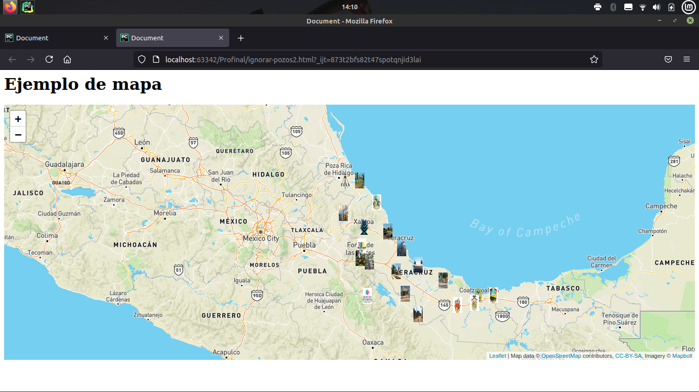
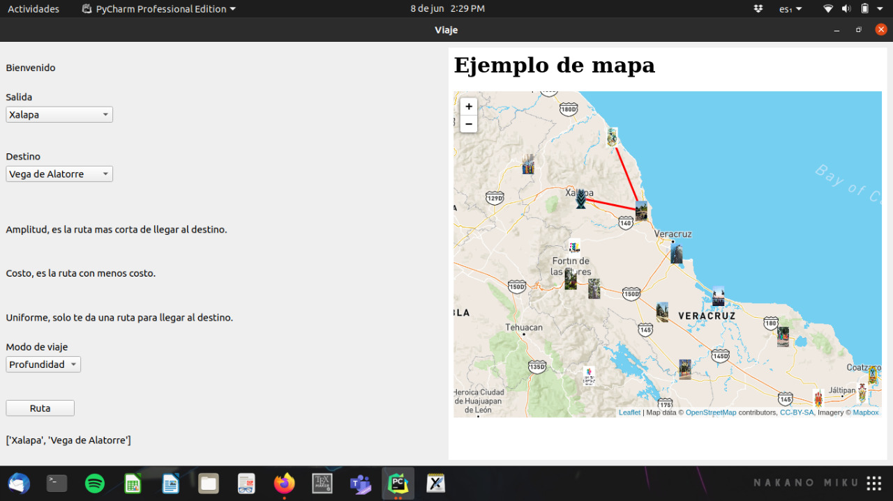

#Proyecto Final.

**Josue Jerezano, Eduardo Pozos y Brenda Medina**

El siguiente proyecto implementa un método de búsquedas no heurísticas, a saber:

**Amplitud, costo uniforme y profundidad**.

Para ello se seleccionaron algunas ciudades del estado de Veracruz, a partir de un origen y destino dado por
el usuario, se devolverá una ruta de acuerdo a las búsquedas antes mencionadas.
Recordemos que la búsqueda no heurística es también conocida como búsqueda no informada asi como también son denominadas
búsquedas a ciegas, esto último debido a que no tienen información suficiente acerca de los estados.
La información requerida se reduce a las ciudades, el costo de posibles movimientos y los canales de comunicación. 
Con esta información se crean las rutas.

La ventana principal está dividida en dos partes, en el lado izquierdo se encuentran las opciones a seleccionar,
las cuales están en un *Qcombox*. 

Primero se selecciona la salida, luego el pueblo al que deseamos visitar, posteriormente se encuentra una pequeña 
descripción de las formas de viajar, es decir, loas rutas dadas por los métodos de búsqueda citados arriba.

* En la opción *amplitud* lo que se tiene es el recorrido más rápido.
* En la opción *costo* nos da la ruta con menor gasto.
* Por último en la opción de *profundidad*, en este caso es una ruta más larga, si es que se desea pasar por más 
  ciudades.

Una vez seleccionado estas opciones, con el botón de ruta en la parte inferior nos dara una lista donde nos indicara 
por cuáles ciudades debemos ir para llegar a nuestro destino.
En el apartado derecho se muestra un mapa, donde están localizadas cada ciudad y los caminos que existen entre dichas
ciudades.

La función de amplitud lo que hace es una vez que tiene la salida y el destino, para la salida se buscaran las ciudades
vecinas y a partir de ellos se iran extendiendo los nodos de manera horizontal, sin repetir ciudades que ya se
encuentren en el camino.

La función costo recibe como argumento un mapa con los vecinos (ordenados de acuerdo al menor costo de viaje), la ciudad
de origen y el destino. 
Posteriormente se realiza un desplazamiento al primer vecino de la ciudad inicial, pues con el orden dado, dicha ciudad
será la que tenga el menor costo de viaje, ignoramos las otras opciones. Este proceso se realiza hasta encontrar la
ciudad destino.
Si en dado momento ya no hay más vecinos para avanzar, regresamos a la ciudad inmediata anterior, borramos la opción 
primera, tanto de la ruta como del mapa (pues no nos lleva a nada), continuamos desde dicho punto.

La función profundidad, opera de la misma manera que la función costo, con la excepción de que al momento de elegir
un vecino, se escoge el que se encuentra más profundo,en este caso al que mayor costo de viaje tenga.
